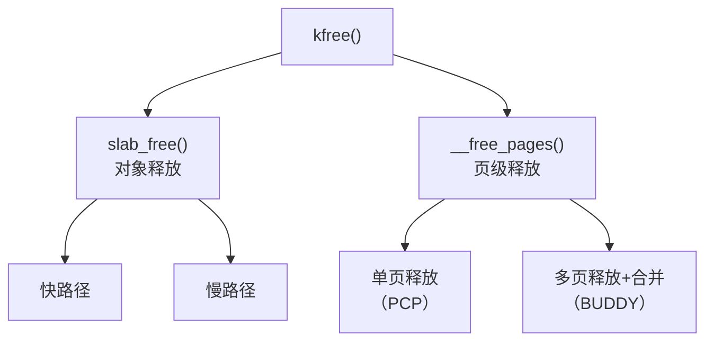

# 前言 
正如入门篇所说的，`kfree()`和`kmalloc()`一样有两个分支：
- SLAB对象释放（较常用）
- 页级释放（较少用）

不过再深入写我们就能发现，其实还有更多的小分支，那么，我们直入正题吧。

# 1. 调用链
> 文件路径：/mm/slub.c : 4109
> 函数名：`void kfree(const void *x)`

和`kmalloc()`的SLAB对象分配一样，`kfree()`的SLAB对象释放也有快慢路径。 
至于页级分配的单页/多页释放的区别，是因为单页需要缓存，而多页不需要，具体的我们到该节细说。

# 2. SLAB对象释放
> 文件路径：/mm/slub.c : 3100
> 函数名：`static __always_inline void do_slab_free(struct kmem_cache *s,
				struct page *page, void *head, void *tail,
				int cnt, unsigned long addr)`

由于SLAB对象释放通常是更常用的那个，所以我们就先说SLAB对象释放。

\# **什么时候快路径，什么时候慢路径？**  
在`kmalloc()`，快路径是因为可以直接找到空闲对象，慢路径则是因为不可以直接找到空闲对象。 
在`kfree()`则有点不那么相同，因为我们并需要找到空闲对象，我们只需要把手上的对象挂回SLAB上。

所以，我们需要先找到`kfree()`传入的地址属于哪个页，也就是哪个SLAB。 
如果这个SLAB正好是当前CPU所缓存的SLAB，那么就直接让当前对象指向它的SLAB，之后处理一些东西就结束了。

从做的东西就能看出来，做这么少，肯定是快路径。 
Linux内核开发者们认为SLAB对象是一个会迅速分配并迅速释放的东西，因此这便成为了`kfree()`中的对象释放快路径。

接下来，我们就来看看快慢路径都是怎么运作的。

# 2.1. 快路径
> 文件路径：/mm/slub.c : 3127
> 函数名：`static __always_inline void do_slab_free(struct kmem_cache *s,
				struct page *page, void *head, void *tail,
				int cnt, unsigned long addr)`

快路径的触发条件为：释放的对象所属的SLAB正好是当前CPU所缓存的SLAB

触发后，内核会让对象的FREE POINTER存储FREELIST的地址，也就是让FREE POINTER存储FREELIST中的第一个空闲对象或NULL。 
之后，FREELIST会指向对象的地址，因为此时，对象已经变成了第一个空闲对象，它所指向的可能就是第二个空闲对象。（或NULL）

# 2.2 慢路径
> 文件路径：/mm/slub.c : 2917
> 函数名：`static void __slab_free(struct kmem_cache *s, struct page *page,
			void *head, void *tail, int cnt,
			unsigned long addr)`

慢路径的触发条件就是没触发成快路径。

在慢路径下，内核可能会让SLAB缓存到CPU上，缓存的条件为：
- SLAB将从满变为非满状态
- 可以在CPU上缓存（有些SLAB不可以，可能是因为大小限制）

这种情况在该上下文称之为：NEW FROZEN

当决定了SLAB是否为NEW FROZEN后，对象会迅速被释放。
不久后，NEW FROZEN SLAB就会被缓存到CPU上的PARTIAL链表了。

\# **分支判断**  
SLUB的对象释放有不少的分支，不过`kfree()`不会触发某些情况，我们将不会专注于解释`kfree()`之外的情况。

SLUB分为了以下几种情况：
1. 普通情况
这种情况下会直接返回，什么都不做，因为已经SLUB已经从满变为了非满，对象也被释放了。

2. SLAB本身不支持在CPU上缓存，而是在NODE上缓存，并且是从满变为了半满
那么内核就会把SLAB从FULL链表中移除（有些配置不支持FULL，这个可能不会执行），并把SLAB移入PARTIAL链表中。

3. SLAB从非空变为空，且CPU和NODE都不再需要PARTIAL SLAB
这种会分两种情况，判断方式为SLAB原本是PARTIAL还是FULL。 
- PARTIAL：从PARTIAL链表中移除SLAB
- FULL：从FULL链表中移除SLAB

注：由于`kfree()`只会释放一个对象，所以`3.FULL`是不可能触发的情况。

最后不管怎么样，都会把整个SLAB从系统中抹除干净，也就是把内存归还给BUDDY SYSTEM。

