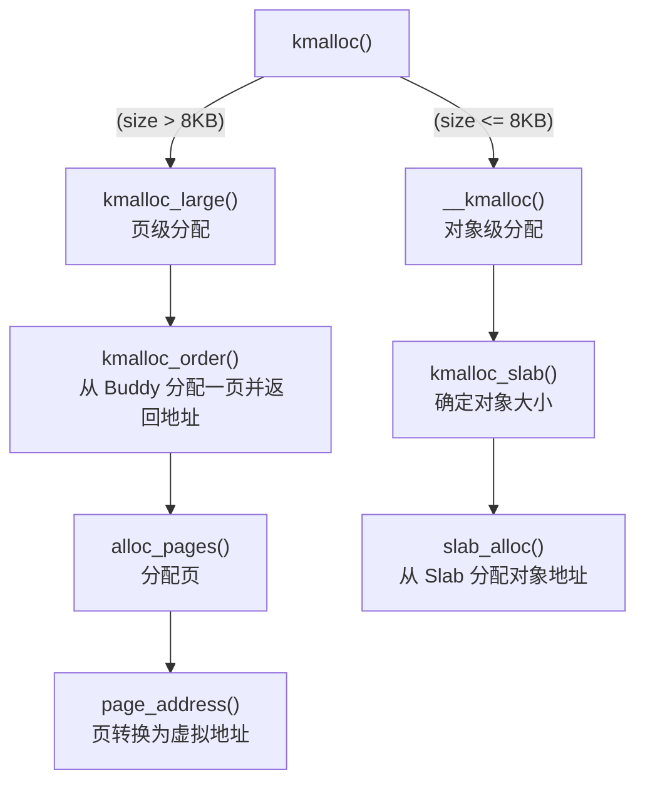

# 前言
如果还没看过“入门级：kmalloc()”的话，可以先去看看，当然如果自认为已经对`kmalloc()`的作用理解得很深了，也可以不看。
但是，如果在本文中遇到一些不理解的地方，可以试试去看看“入门级：kmalloc()”。

我会尽量少用代码说明，因为Linux内核代码是很庞大的，太多的话会让整篇博文变得非常乱，也难以阅读。

注：该博文基于**Linux 5.10.245**内核，配置为**SLUB**而非SLAB。


# 1. 调用链
> 文件路径：/include/linux/slab.h : 538 <br>
> 函数名：`static __always_inline void *kmalloc(size_t size, gfp_t flags)`

这个先粗略看看就好了，只要知道有两种分配就行了，详细的我们接下来就会说了。


# 2. SLAB分配
> 文件路径：/mm/slub.c : 3959 <br>
> 函数名：`void *__kmalloc(size_t size, gfp_t flags)`

`kmalloc()`处理SLAB的频率是远高于处理页的，这也是我优先详解SLAB分支的原因，而且页级分配一般会使用`alloc_pages()`而非`kmalloc()`。

\## 2.1. **SLAB调用链** <br>
分配SLAB的工作主要分为2步，分别是：
1. 找到合适的对象大小
2. 分配一个该大小的空闲对象


## 2.2. 找到合适的大小
> 文件路径：/mm/slab_common.c : 632 <br>
> 函数名：`struct kmem_cache *kmalloc_slab(size_t size, gfp_t flags)`

Linux内核内置了一些`kmem_cache`，这个函数会根据我们传入的`size`和`flags`选出合适的`kmem_cache`。

\## **2.2.1 什么是合适的呢？** <br>
合适的意思就是：
- 大小满足`size`（可能刚好，也有可能大一些）
- 类型满足`flags`（比如DMA内存分配）

\## **核心逻辑伪代码**
```c
if (size <= 192) {
	/* 使用预计算的大小索引 */
	index = size_index[(size-1)/8];  
} else {
	/* 计算最高位位置 */
	index = fls(size-1);  
}
/* 
 * 返回合适的`kmem_cache`
 * - 对象大小最小满足要求  
 * - 内存类型符合flags指定（DMA/NORMAL/RECLAIMABLE）
 */
return kmalloc_caches[type][index];
```


## 2.3. 分配空闲对象
> 文件路径：/mm/slub.c : 2817 <br>
> 函数名：`static __always_inline void *slab_alloc_node(struct kmem_cache *s,
		gfp_t gfpflags, int node, unsigned long addr)`

\## **乐观锁** <br>
这里稍微说一下Linux内核常用的一个锁，名为**乐观锁（Optimistic Lock）**。

一般由以下方式工作：
- 不判断太多东西，也不会因锁导致阻塞
- 直接开始执行核心代码
- 执行后再判断条件（比如版本号之类的）
> 在SLUB，这个版本号就是TID，每个CPU都有自己的TID副本（`kmem_cache_cpu`）
- 如果判断结果为假，那么就重新开始
- 如果为真，那么就可以推出了

乐观锁假设数据不会被其他线程修改，如果被修改了，就会重新执行。<br>
乐观锁的优点是提升性能，因为没有了加锁和解锁的开销。

\## **2.3.2 快慢路径** <br>
在Linux内核能看到，内存分配和释放一般都会有两种路径，分别为**快与慢路径（Fast/Slow Path）**。

快路径一般会更频繁的触发，而慢路径则更少被触发。
但是慢路径比快路径更加的宽容，更加的通用，因为慢路径一般在内存紧张的环境下被触发的，所以会宽容的允许内存碎片化或其他影响系统流畅性的东西存在。

\## **核心伪代码**
```c
	object = c->freelist;
	page = c->page;

	if (unlikely(!object || !page || !node_match(page, node))) {
		/*
		 *
		 * 条件1：当前SLAB满了（没有空闲对象）
		 * 条件2：CPU缓存内压根没有SLAB PAGE（极为少见）
		 * 条件3：CPU存储的SLAB PAGE与参数要求的NUMA节点不符
		 * 
		 * 在`kmalloc()`的调用链下，条件3为真的概率近乎为0，
		 * 因为`kmalloc()`并不会指定任何一个NUMA节点
		 *
		 */
		object = slow_path();
	} else {
		fast_path();
	}
	/*
	 *
	 * 善后工作，本篇不会详解
	 * 
	 * 善后工作就像吃饭后洗碗一样重要
	 * 可以让下一次调用更加快速且方便
	 * 但是本篇专注于怎么吃饭这个问题
	 *
	 */
	followup_work(); 	
	return object;
```


### 2.3.2. 快路径
> 文件路径：/mm/slub.c : 2867 <br>
> 函数名：`static __always_inline void *slab_alloc_node(struct kmem_cache *s,
		gfp_t gfpflags, int node, unsigned long addr)`

快路径并没有一个具体的函数，只是一个条件判断分支下的代码块。

快路径的原理并不复杂，就只是获取当前空闲对象，并返回，仅此而已。<br>
甚至，对象的获取早在之前就完成了，快路径负责的只是一部分的善后工作。
可以先看看这个MERMAID图：


### 2.3.2.1 慢路径
> 文件路径：/mm/slub.c : 2669 <br>
> 函数名：`static void *___slab_alloc(struct kmem_cache *s, gfp_t gfpflags, int node,
			  unsigned long addr, struct kmem_cache_cpu *c)`

慢路径和快路径有一点不一样，快路径执行的前提是找到了空闲对象，找不到的话就会执行慢路径。
也就是说，慢路径的主要目的是“找到空闲对象”。
当系统在CPU缓存内找不到空闲对象，那么，就会有几个办法。

\### **错误处理：更换NUMA节点** <br>
严格来说，这不属于牺牲性能来获取空闲对象的方法。<br>
因为只有在指定NUMA节点离线时，才会触发这个。<br>
至于NUMA节点离线是什么，我想大概是服务器的CPU热插拔之类的。

\### **备用SLAB** <br>
但是其实`kmem_cache_cpu`内还有一个名为`partial`的字段，里面存储了一些PARTIAL的SLAB PAGE，我们可以把`c->page`更换为`partial`内的SLAB PAGE，由于它的名字就叫PARTIAL了，所以可以确认，里面肯定是有空闲对象的。

\### **上层仓库** <br>
除了`kmem_cache_cpu`，系统还有`kmem_cache_node`，我们可能可以从`kmem_cache_node`上找到一些SLAB PAGE，这已经是一个极为昂贵的开销了，不过也是一种办法。

\### **BUDDY SYSTEM** <br>
这是最为昂贵的一种解决方法，也就是直接再创建一个PARTIAL SLAB，昂贵是因为需要申请内存+各种初始化。<br>
就像店里没有小蛋糕了，在店内也找不到其他蛋糕了，甚至隔壁分行都没有了。<br>
那么就只能从工厂进货原材料，然后重新坐一块大蛋糕，再让厨师把蛋糕切小块，会消耗非常多时间。


### 2.3.3. 小结
总而言之，在慢路径会先找到最靠近的、开销最小的对象，先查SLAB（口袋）、再查NODE缓存（包里），都没有的话，才会去创建一个新的（重新买一个）。
至于快路径的话...快路径就只是稍微处理一下就返回了，没什么难理解的。


## 3. 页级分配
> 文件路径：/mm/slab_common.c : 826 <br>
> 函数名：`void *kmalloc_order(size_t size, gfp_t flags, unsigned int order)`

这个是申请大于8KB时触发的分支，分配的单位一般为4KB，ARM64的话可能是16KB。

但是页级分配底层所用的并非是字节，而是ORDER，ORDER代表的是页数，但是还得稍微计算一下，计算的方法如下：
```c
/* Order To NPages */
npages = (1 << order);
```

\## **3.1 为什么不是NPAGES而是ORDER** <br>
使用ORDER而非NPAGES的一大原因是BUDDY SYSTEM的特性所导致的。<br>
Buddy支持把物理地址连续的页合起来，但是合起来的条件是两边的ORDER一样。如果换成NPAGES的话，将会变得非常难处理。

\## **3.2 问题：计算性能** <br>
要计算BUDDY页地址，可以直接用以下公式获得：
```c
/*
 * 这个异或操作的精妙之处在于：
 * - 能快速找到「BUDDY页」的物理地址
 * - 保证两个伙伴块可以完美合并成更大的连续块
 */
buddy_pfn = cur_page_pfn ^ (1 << order);
buddy_page = cur_page + (buddy_pfn - cur_pfn);
```
这只需要很少的CPU指令就能计算完成了，而支持NPAGES的话就得使用较为复杂的数学计算。

主要还是位运算在CPU上比复杂的数学运算更容易。

\## **3.3 庞大的数据结构** <br>
目前，Linux内核是给每个ORDER维护一个FREELIST链表。

如果使用ORDER的话，只需要12个链表结构就能很好的满足大部分。<br>
但是如果我们使用的是NPAGES的话，就得维护4096个链表结构了，而且还有可能存在大部分链表都是空的情况，这显然是非常不利于维护的方案。

\## **3.4 问题总结** <br>
经过多年的实践验证，ORDER作为内存分配的粒度单位，在**性能**、**内存效率**和**实现简洁性**方面都优于直接的页数计数，是比NPAGES更加合适的选择。


# 4. 本篇总结
`kmalloc()` 作为Linux内核最常用的内存分配器，其设计体现了「分场景优化」的智慧：

### 4.1 两种分配策略
- **SLAB路径**（≤8KB）：基于SLAB分配器，为小内存分配极致优化
- **页级路径**（>8KB）：直接对接BUDDY SYSTEM，保证大块连续内存

### 4.2 SLAB的精妙设计
- **快慢路径分离**：90%的分配走快速通道，10%的特殊情况有保底机制
- **空间与时间**：通过多级缓存（CPU → NODE → BUDDY）实现分配速度与内存利用的平衡

### 4.3 学习价值
通过分析`kmalloc()`，我们不仅学会了内存分配API的使用，更窥见了Linux内核「针对不同场景使用不同算法」的设计思想。这种分层优化的思路值得在所有性能敏感的开发中借鉴。


最后编辑时间：2025/10/31 PM05:11
