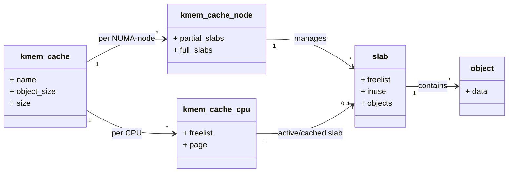

# 前言
这篇博文是我对自己之前的博文的一个简化版，因为考虑到不是所有人都希望看庞大且复杂的代码，所以我就对大部分较为复杂的内容进行了合适的删减，利于新手阅读。
不过还是得提醒一下，我只学了编程9个月（快10个月了），所以大部分说的并不会很详细。
而且，这个博文是基于我的笔记进行修改的，所以如果将这篇博文视为一篇教学相的博文，一定也有许多不足之处，还请各位大佬轻点喷。

废话说很多了，直入正题吧。


# 0. `kmalloc()`的定义
```c
void * kmalloc(size_t size, int flags)
```
`size`：大小（字节）
<br>
`flags`：就是GFP_MASK，可以看本文的`6. GFP_MASK`节


# 1. 什么情况下要用到`kmalloc()`？
`kmalloc()`一般在以下几种场景下使用：<br>

\## 1.1 小于一页的内存申请：<br>
`kmalloc()`会智能地分配一些容量较小的内存，所以为字节级结构体申请内存时，可以使用`kmalloc()`。

\## 1.2 复合页申请：<br>
由于`kmalloc()`的页级分配默认使用（不可改）`__GFP_COMP`进行页级分配，所以如果明确自己应该申请一个复合页时，就可以使用`kmalloc()`简单的申请这类内存。


# 2. 为什么这些场景要使用`kmalloc()`，`kmalloc()`的特点是什么？
`kmalloc()`的特点是：<br>
- 物理地址连续：分配的内存保证在物理上是连续的，这对DMA操作很重要
- 虚拟地址连续：在虚拟地址空间也是连续的，和`vmalloc()`一样
- 节省内存：对小内存分配有专门优化
- 使用简单：一行代码就能完成分配

与其他函数对比：<br>
`vmalloc()`：虚拟地址连续但物理地址不一定连续，性能稍差，但是更适合申请大内存。
<br>
`alloc_pages()`：更底层，需要手动转换页地址，但是更灵活。

而且对于字节级分配而言，`kmalloc()`给了一个不错的方案，简单的调用`kmalloc()`便能分配一个小内存，虽然内存大小不一定是调用时所输入的大小，但是一般来说不会大的离谱。

注：如果有特殊的需求，可以考虑自己创建特殊的`kmem_cache`。


# 3. 什么情况下应该避免使用`kmalloc()`？
`kmalloc()`虽然好用，但是也不是万能的内存分配函数，错误的使用会导致内存碎片化————内存中充满大小不等的空闲块，虽然总空间足够，但缺乏大块连续内存，影响系统性能和大内存分配。

所以我们应该避免在以下几种情况下使用`kmalloc()`：<br>
\## 3.1. 大内存分配：<br>
在条件允许的情况下，避免使用`kmalloc()`进行大内存分配。

\## 3.1.1 对应解决方案：<br>
可以考虑使用`vmalloc()`，虽然性能没有`kmalloc()`好，但是虚拟地址仍然是连续的，除了硬件，一般并不关心物理地址是否是连续的。

注：`kmalloc()`最大能分配的大小取决于系统配置，通常不超过几MB


# 4. SLAB的入门级理解
我们刚刚说了`kmalloc()`可以智能的分配一些小内存，其实这些小内存正确的叫法应该是“对象（OBJECT）”。

SLAB是一种管理小内存的分配器，一般用于管理小于4KB以下的内存。

\## 4.1 为什么SLAB存在？
MMU所能操作的最小单位为一页（x64为4KB，arm64则是16KB），但是这对于部分内存分配来说可能过大了。
比如以下这种场景。
```c
struct foobar {
	int x;
	int y;
	int z;
};

struct foobar *foobar2000 = kmalloc(sizeof(struct foobar), GFP_KERNEL);
```
如果没有SLAB的话，每一次调用`kmalloc()`会直接返回一个全新的页，但是`sizeof(struct foobar))`是绝对没有4KB那么大的，甚至可以说是天差地别。
有SLAB的情况下，就不会发生这种情况。

\## 4.2 SLAB究竟是什么？
可以这么理解，本来的情况是，顾客买了一块小蛋糕，但是交到顾客手里的盒子却是大蛋糕的大小，这显然是很浪费盒子的，小蛋糕装大盒子。
所以SLAB的做法就是，将一个标准大蛋糕盒子（一页）分成固定大小的几个小蛋糕盒子（对象），这样，当顾客买小蛋糕时，就能分配不会太大的小蛋糕盒子了。

SLAB用链表管理各个对象，这样管理更高效。
内核创建了许多较为通用的`kmem_cache`，这个词可以理解为对象大小，内核通用的`kmem_cache`大小一般为（2^幂次方）字节。

下面提供一个MERMAID图让读者们更易于理解：<br>

注：这个看不懂也没关系的，可以之后学习到了SLAB相关的再看。


# 5. 编程技巧
在使用`kmalloc()`或类似的内存分配函数时，最好尽快检查是否分配成功，以避免在程序运行时，在奇怪的时间点报错，这会导致调试变得很难。
```c
void *foobar = NULL; /* 初始化 */
foobar = kmalloc(16, GFP_KERNEL);
if (foobar == NULL) {
	printk(KERN_ERR "error: alloc failed\n");
	return -1;
}
```
尽快的发现错误总比让错误存在下去更好，毕竟没人想要在做重要的事情时突然报错死机。


# 6. GFP_MASK
可以根据场景选择对应的`GFP_MASK`，我会给出几个较为常用和简单的`GFP_MASK`和对应的场景。

\## 6.1 根据场景选择合适的标志<br>
| 场景 | 推荐标志 |
|------|----------|
| 一般情况（可睡眠） | `GFP_KERNEL` |
| 中断上下文（不可睡眠） | `GFP_ATOMIC` |
| DMA内存（可睡眠） | `GFP_DMA \| GFP_KERNEL` |
| DMA内存（不可睡眠） | `GFP_DMA \| GFP_ATOMIC` |


# 7. 总结
`kmalloc()`是Linux内核中最常用的内存分配函数之一，特别适合小内存和需要物理连续性的场景。
通过SLAB分配器的智能管理，它能够在保证性能的同时提高内存利用率。

记住几个关键点：
- 小内存用`kmalloc()`，大内存考虑`vmalloc()`
- 分配后一定要检查返回值
- 根据执行上下文选择合适的GFP标志

想了解更多实现细节的话可以看“读代码篇”。


最后编辑时间：2025/10/30 PM03:49
